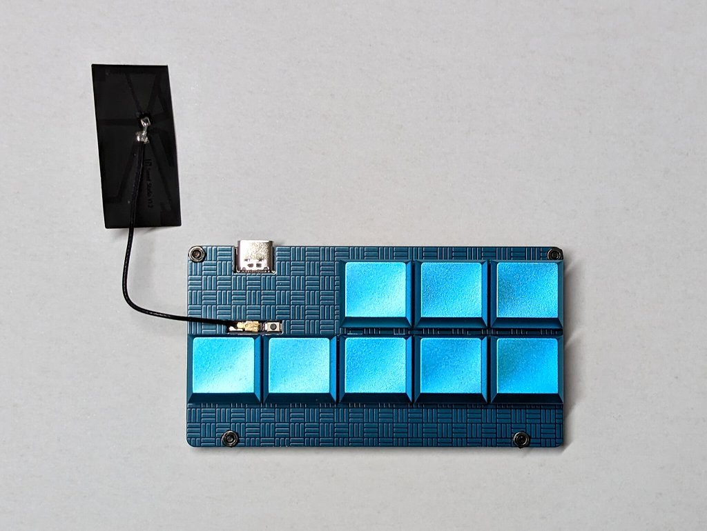

# joker8_esp32c3_heos_lgtv

This project is an example to demonstrate HEOS devices and LG TVs control. It works on a Joker8 macropad as below.

## Hardware requirements

* [Joker8](https://blog.alglab.net/archives/joker8-xiaorp2040-macropad-en/) Kit
* Seeed Studio XIAO ESP32C3

Joker8 doesn't support XIAO ESP32C3 but XIAO RP2040 officially. This project doesn't work with XIAO RP2040. XIAO ESP32C3 and XIAO RP2040 are pin compatible modules.

## Feature list

Each button may have one or more features.

* (HEOS) SetVolume
* (HEOS) VolumeUp
* (HEOS) VolumeDown
* (HEOS) SetMute (Mute or Unmute)
* (HEOS) ToggleMute
* (HEOS) PlayInputSource (ANALOG_IN_1, USBDAC, OPTICAL_IN_1 etc.)
* (LGTV) SwitchInput (HDMI1, HDMI2, HDMI3 or HDMI4)

## Build Environment

* PlatformIO

## Dependencies

* bblanchon/ArduinoJson@^6.21.2
* links2004/WebSockets@^2.4.1

## Reference

* HEOS CLI Protocol Specification v1.17
  * Please find pdf files from Denon, Marantz or B&W webpages
* [hobbyquaker/lgtv2](https://github.com/hobbyquaker/lgtv2)
